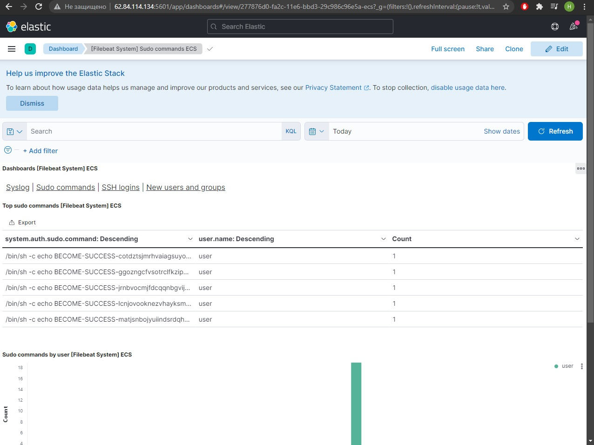

# Install and configure Elasticsearch, Kibana and FileBeat for collect system logfiles

Variables:
| Variable | Description |
|----------|-------------|
|elk_stack_version| Set version of ELK stack|
  


# Домашнее задание к занятию "08.03 Использование Yandex Cloud"

## Основная часть
1. Допишите playbook: нужно сделать ещё один play, который устанавливает и настраивает kibana.
2. При создании tasks рекомендую использовать модули: `get_url`, `template`, `yum`, `apt`.
3. Tasks должны: скачать нужной версии дистрибутив, выполнить распаковку в выбранную директорию, сгенерировать конфигурацию с параметрами.
4. Приготовьте свой собственный inventory файл `prod.yml`.
5. Запустите `ansible-lint site.yml` и исправьте ошибки, если они есть.
```sh
$ ansible-lint site.yml && echo $?
0
```
6. Попробуйте запустить playbook на этом окружении с флагом `--check`.
```
$ ansible-playbook -i inventory/prod/hosts.yml site.yml --check

PLAY [Install Elasticsearch] **********************************************************

TASK [Gathering Facts] ****************************************************************
ok: [el-vm]

TASK [Download Elasticsearch's rpm] ***************************************************
changed: [el-vm]

TASK [Install Elasticsearch] **********************************************************
fatal: [el-vm]: FAILED! => {"changed": false, "msg": "No RPM file matching '/tmp/elasticsearch-7.14.1-x86_64.rpm' found on system", "rc": 127, "results": ["No RPM file matching '/tmp/elasticsearch-7.14.1-x86_64.rpm' found on system"]}

PLAY RECAP ****************************************************************************
el-vm                      : ok=2    changed=1    unreachable=0    failed=1    skipped=0    rescued=0    ignored=0
```
7. Запустите playbook на `prod.yml` окружении с флагом `--diff`. Убедитесь, что изменения на системе произведены.
```
$ ansible-playbook -i inventory/prod/hosts.yml site.yml --diff

PLAY [Install Elasticsearch] ****************************************************

TASK [Gathering Facts] **********************************************************
ok: [el-vm]

TASK [Download Elasticsearch's rpm] *********************************************
changed: [el-vm]

TASK [Install Elasticsearch] ****************************************************
changed: [el-vm]

TASK [Configure Elasticsearch] **************************************************
--- before: /etc/elasticsearch/elasticsearch.yml
+++ after: /home/user/.ansible/tmp/ansible-local-8715wgpu7odh/tmpeem6fdl3/elasticsearch.yml.j2
@@ -1,82 +1,7 @@
-# ======================== Elasticsearch Configuration =========================
-#
-# NOTE: Elasticsearch comes with reasonable defaults for most settings.
-#       Before you set out to tweak and tune the configuration, make sure you
-#       understand what are you trying to accomplish and the consequences.
-#
-# The primary way of configuring a node is via this file. This template lists
-# the most important settings you may want to configure for a production cluster.
-#
-# Please consult the documentation for further information on configuration options:
-# https://www.elastic.co/guide/en/elasticsearch/reference/index.html
-#
-# ---------------------------------- Cluster -----------------------------------
-#
-# Use a descriptive name for your cluster:
-#
-#cluster.name: my-application
-#
-# ------------------------------------ Node ------------------------------------
-#
-# Use a descriptive name for the node:
-#
-#node.name: node-1
-#
-# Add custom attributes to the node:
-#
-#node.attr.rack: r1
-#
-# ----------------------------------- Paths ------------------------------------
-#
-# Path to directory where to store the data (separate multiple locations by comma):
-#
 path.data: /var/lib/elasticsearch
-#
-# Path to log files:
-#
 path.logs: /var/log/elasticsearch
-#
-# ----------------------------------- Memory -----------------------------------
-#
-# Lock the memory on startup:
-#
-#bootstrap.memory_lock: true
-#
-# Make sure that the heap size is set to about half the memory available
-# on the system and that the owner of the process is allowed to use this
-# limit.
-#
-# Elasticsearch performs poorly when the system is swapping the memory.
-#
-# ---------------------------------- Network -----------------------------------
-#
-# By default Elasticsearch is only accessible on localhost. Set a different
-# address here to expose this node on the network:
-#
-#network.host: 192.168.0.1
-#
-# By default Elasticsearch listens for HTTP traffic on the first free port it
-# finds starting at 9200. Set a specific HTTP port here:
-#
-#http.port: 9200
-#
-# For more information, consult the network module documentation.
-#
-# --------------------------------- Discovery ----------------------------------
-#
-# Pass an initial list of hosts to perform discovery when this node is started:
-# The default list of hosts is ["127.0.0.1", "[::1]"]
-#
-#discovery.seed_hosts: ["host1", "host2"]
-#
-# Bootstrap the cluster using an initial set of master-eligible nodes:
-#
-#cluster.initial_master_nodes: ["node-1", "node-2"]
-#
-# For more information, consult the discovery and cluster formation module documentation.
-#
-# ---------------------------------- Various -----------------------------------
-#
-# Require explicit names when deleting indices:
-#
-#action.destructive_requires_name: true
+network.host: 0.0.0.0
+discovery.seed_hosts: ["10.128.0.20"]
+node.name: node-a
+cluster.initial_master_nodes: 
+   - node-a

changed: [el-vm]

RUNNING HANDLER [restart Elasticsearch] *****************************************
changed: [el-vm]

PLAY [Install Kibana] ***********************************************************

TASK [Gathering Facts] **********************************************************
ok: [k-vm]

TASK [Download Kibana's rpm] ****************************************************
changed: [k-vm]

TASK [Install Kibana] ***********************************************************
changed: [k-vm]

TASK [Configure Kibana] *********************************************************
--- before: /etc/kibana/kibana.yml
+++ after: /home/user/.ansible/tmp/ansible-local-8715wgpu7odh/tmpqyn_8p6q/kibana.yml.j2
@@ -1,111 +1,3 @@
-# Kibana is served by a back end server. This setting specifies the port to use.
-#server.port: 5601
-
-# Specifies the address to which the Kibana server will bind. IP addresses and host names are both valid values.
-# The default is 'localhost', which usually means remote machines will not be able to connect.
-# To allow connections from remote users, set this parameter to a non-loopback address.
-#server.host: "localhost"
-
-# Enables you to specify a path to mount Kibana at if you are running behind a proxy.
-# Use the `server.rewriteBasePath` setting to tell Kibana if it should remove the basePath
-# from requests it receives, and to prevent a deprecation warning at startup.
-# This setting cannot end in a slash.
-#server.basePath: ""
-
-# Specifies whether Kibana should rewrite requests that are prefixed with
-# `server.basePath` or require that they are rewritten by your reverse proxy.
-# This setting was effectively always `false` before Kibana 6.3 and will
-# default to `true` starting in Kibana 7.0.
-#server.rewriteBasePath: false
-
-# Specifies the public URL at which Kibana is available for end users. If
-# `server.basePath` is configured this URL should end with the same basePath.
-#server.publicBaseUrl: ""
-
-# The maximum payload size in bytes for incoming server requests.
-#server.maxPayload: 1048576
-
-# The Kibana server's name.  This is used for display purposes.
-#server.name: "your-hostname"
-
-# The URLs of the Elasticsearch instances to use for all your queries.
-#elasticsearch.hosts: ["http://localhost:9200"]
-
-# Kibana uses an index in Elasticsearch to store saved searches, visualizations and
-# dashboards. Kibana creates a new index if the index doesn't already exist.
-#kibana.index: ".kibana"
-
-# The default application to load.
-#kibana.defaultAppId: "home"
-
-# If your Elasticsearch is protected with basic authentication, these settings provide
-# the username and password that the Kibana server uses to perform maintenance on the Kibana
-# index at startup. Your Kibana users still need to authenticate with Elasticsearch, which
-# is proxied through the Kibana server.
-#elasticsearch.username: "kibana_system"
-#elasticsearch.password: "pass"
-
-# Enables SSL and paths to the PEM-format SSL certificate and SSL key files, respectively.
-# These settings enable SSL for outgoing requests from the Kibana server to the browser.
-#server.ssl.enabled: false
-#server.ssl.certificate: /path/to/your/server.crt
-#server.ssl.key: /path/to/your/server.key
-
-# Optional settings that provide the paths to the PEM-format SSL certificate and key files.
-# These files are used to verify the identity of Kibana to Elasticsearch and are required when
-# xpack.security.http.ssl.client_authentication in Elasticsearch is set to required.
-#elasticsearch.ssl.certificate: /path/to/your/client.crt
-#elasticsearch.ssl.key: /path/to/your/client.key
-
-# Optional setting that enables you to specify a path to the PEM file for the certificate
-# authority for your Elasticsearch instance.
-#elasticsearch.ssl.certificateAuthorities: [ "/path/to/your/CA.pem" ]
-
-# To disregard the validity of SSL certificates, change this setting's value to 'none'.
-#elasticsearch.ssl.verificationMode: full
-
-# Time in milliseconds to wait for Elasticsearch to respond to pings. Defaults to the value of
-# the elasticsearch.requestTimeout setting.
-#elasticsearch.pingTimeout: 1500
-
-# Time in milliseconds to wait for responses from the back end or Elasticsearch. This value
-# must be a positive integer.
-#elasticsearch.requestTimeout: 30000
-
-# List of Kibana client-side headers to send to Elasticsearch. To send *no* client-side
-# headers, set this value to [] (an empty list).
-#elasticsearch.requestHeadersWhitelist: [ authorization ]
-
-# Header names and values that are sent to Elasticsearch. Any custom headers cannot be overwritten
-# by client-side headers, regardless of the elasticsearch.requestHeadersWhitelist configuration.
-#elasticsearch.customHeaders: {}
-
-# Time in milliseconds for Elasticsearch to wait for responses from shards. Set to 0 to disable.
-#elasticsearch.shardTimeout: 30000
-
-# Logs queries sent to Elasticsearch. Requires logging.verbose set to true.
-#elasticsearch.logQueries: false
-
-# Specifies the path where Kibana creates the process ID file.
-#pid.file: /run/kibana/kibana.pid
-
-# Enables you to specify a file where Kibana stores log output.
-#logging.dest: stdout
-
-# Set the value of this setting to true to suppress all logging output.
-#logging.silent: false
-
-# Set the value of this setting to true to suppress all logging output other than error messages.
-#logging.quiet: false
-
-# Set the value of this setting to true to log all events, including system usage information
-# and all requests.
-#logging.verbose: false
-
-# Set the interval in milliseconds to sample system and process performance
-# metrics. Minimum is 100ms. Defaults to 5000.
-#ops.interval: 5000
-
-# Specifies locale to be used for all localizable strings, dates and number formats.
-# Supported languages are the following: English - en , by default , Chinese - zh-CN .
-#i18n.locale: "en"
+server.host: "0.0.0.0"
+elasticsearch.hosts: ["http://10.128.0.20:9200"]
+kibana.index: ".kibana"
\ No newline at end of file

changed: [k-vm]

RUNNING HANDLER [restart Kibana] ************************************************
changed: [k-vm]

PLAY [Install filebeat] *********************************************************

TASK [Gathering Facts] **********************************************************
ok: [app-vm]

TASK [Download Filebeat's rpm] **************************************************
changed: [app-vm]

TASK [Install Filebeat] *********************************************************
changed: [app-vm]

TASK [Configure Filebeat] *******************************************************
--- before: /etc/filebeat/filebeat.yml
+++ after: /home/user/.ansible/tmp/ansible-local-8715wgpu7odh/tmpqgwotw66/filebeat.yml.j2
@@ -1,270 +1,5 @@
-###################### Filebeat Configuration Example #########################
-
-# This file is an example configuration file highlighting only the most common
-# options. The filebeat.reference.yml file from the same directory contains all the
-# supported options with more comments. You can use it as a reference.
-#
-# You can find the full configuration reference here:
-# https://www.elastic.co/guide/en/beats/filebeat/index.html
-
-# For more available modules and options, please see the filebeat.reference.yml sample
-# configuration file.
-
-# ============================== Filebeat inputs ===============================
-
-filebeat.inputs:
-
-# Each - is an input. Most options can be set at the input level, so
-# you can use different inputs for various configurations.
-# Below are the input specific configurations.
-
-- type: log
-
-  # Change to true to enable this input configuration.
-  enabled: false
-
-  # Paths that should be crawled and fetched. Glob based paths.
-  paths:
-    - /var/log/*.log
-    #- c:\programdata\elasticsearch\logs\*
-
-  # Exclude lines. A list of regular expressions to match. It drops the lines that are
-  # matching any regular expression from the list.
-  #exclude_lines: ['^DBG']
-
-  # Include lines. A list of regular expressions to match. It exports the lines that are
-  # matching any regular expression from the list.
-  #include_lines: ['^ERR', '^WARN']
-
-  # Exclude files. A list of regular expressions to match. Filebeat drops the files that
-  # are matching any regular expression from the list. By default, no files are dropped.
-  #exclude_files: ['.gz$']
-
-  # Optional additional fields. These fields can be freely picked
-  # to add additional information to the crawled log files for filtering
-  #fields:
-  #  level: debug
-  #  review: 1
-
-  ### Multiline options
-
-  # Multiline can be used for log messages spanning multiple lines. This is common
-  # for Java Stack Traces or C-Line Continuation
-
-  # The regexp Pattern that has to be matched. The example pattern matches all lines starting with [
-  #multiline.pattern: ^\[
-
-  # Defines if the pattern set under pattern should be negated or not. Default is false.
-  #multiline.negate: false
-
-  # Match can be set to "after" or "before". It is used to define if lines should be append to a pattern
-  # that was (not) matched before or after or as long as a pattern is not matched based on negate.
-  # Note: After is the equivalent to previous and before is the equivalent to to next in Logstash
-  #multiline.match: after
-
-# filestream is an input for collecting log messages from files. It is going to replace log input in the future.
-- type: filestream
-
-  # Change to true to enable this input configuration.
-  enabled: false
-
-  # Paths that should be crawled and fetched. Glob based paths.
-  paths:
-    - /var/log/*.log
-    #- c:\programdata\elasticsearch\logs\*
-
-  # Exclude lines. A list of regular expressions to match. It drops the lines that are
-  # matching any regular expression from the list.
-  #exclude_lines: ['^DBG']
-
-  # Include lines. A list of regular expressions to match. It exports the lines that are
-  # matching any regular expression from the list.
-  #include_lines: ['^ERR', '^WARN']
-
-  # Exclude files. A list of regular expressions to match. Filebeat drops the files that
-  # are matching any regular expression from the list. By default, no files are dropped.
-  #prospector.scanner.exclude_files: ['.gz$']
-
-  # Optional additional fields. These fields can be freely picked
-  # to add additional information to the crawled log files for filtering
-  #fields:
-  #  level: debug
-  #  review: 1
-
-# ============================== Filebeat modules ==============================
-
-filebeat.config.modules:
-  # Glob pattern for configuration loading
-  path: ${path.config}/modules.d/*.yml
-
-  # Set to true to enable config reloading
-  reload.enabled: false
-
-  # Period on which files under path should be checked for changes
-  #reload.period: 10s
-
-# ======================= Elasticsearch template setting =======================
-
-setup.template.settings:
-  index.number_of_shards: 1
-  #index.codec: best_compression
-  #_source.enabled: false
-
-
-# ================================== General ===================================
-
-# The name of the shipper that publishes the network data. It can be used to group
-# all the transactions sent by a single shipper in the web interface.
-#name:
-
-# The tags of the shipper are included in their own field with each
-# transaction published.
-#tags: ["service-X", "web-tier"]
-
-# Optional fields that you can specify to add additional information to the
-# output.
-#fields:
-#  env: staging
-
-# ================================= Dashboards =================================
-# These settings control loading the sample dashboards to the Kibana index. Loading
-# the dashboards is disabled by default and can be enabled either by setting the
-# options here or by using the `setup` command.
-#setup.dashboards.enabled: false
-
-# The URL from where to download the dashboards archive. By default this URL
-# has a value which is computed based on the Beat name and version. For released
-# versions, this URL points to the dashboard archive on the artifacts.elastic.co
-# website.
-#setup.dashboards.url:
-
-# =================================== Kibana ===================================
-
-# Starting with Beats version 6.0.0, the dashboards are loaded via the Kibana API.
-# This requires a Kibana endpoint configuration.
+output.elasticsearch:
+    hosts: ["http://10.128.0.20:9200"]
 setup.kibana:
-
-  # Kibana Host
-  # Scheme and port can be left out and will be set to the default (http and 5601)
-  # In case you specify and additional path, the scheme is required: http://localhost:5601/path
-  # IPv6 addresses should always be defined as: https://[2001:db8::1]:5601
-  #host: "localhost:5601"
-
-  # Kibana Space ID
-  # ID of the Kibana Space into which the dashboards should be loaded. By default,
-  # the Default Space will be used.
-  #space.id:
-
-# =============================== Elastic Cloud ================================
-
-# These settings simplify using Filebeat with the Elastic Cloud (https://cloud.elastic.co/).
-
-# The cloud.id setting overwrites the `output.elasticsearch.hosts` and
-# `setup.kibana.host` options.
-# You can find the `cloud.id` in the Elastic Cloud web UI.
-#cloud.id:
-
-# The cloud.auth setting overwrites the `output.elasticsearch.username` and
-# `output.elasticsearch.password` settings. The format is `<user>:<pass>`.
-#cloud.auth:
-
-# ================================== Outputs ===================================
-
-# Configure what output to use when sending the data collected by the beat.
-
-# ---------------------------- Elasticsearch Output ----------------------------
-output.elasticsearch:
-  # Array of hosts to connect to.
-  hosts: ["localhost:9200"]
-
-  # Protocol - either `http` (default) or `https`.
-  #protocol: "https"
-
-  # Authentication credentials - either API key or username/password.
-  #api_key: "id:api_key"
-  #username: "elastic"
-  #password: "changeme"
-
-# ------------------------------ Logstash Output -------------------------------
-#output.logstash:
-  # The Logstash hosts
-  #hosts: ["localhost:5044"]
-
-  # Optional SSL. By default is off.
-  # List of root certificates for HTTPS server verifications
-  #ssl.certificate_authorities: ["/etc/pki/root/ca.pem"]
-
-  # Certificate for SSL client authentication
-  #ssl.certificate: "/etc/pki/client/cert.pem"
-
-  # Client Certificate Key
-  #ssl.key: "/etc/pki/client/cert.key"
-
-# ================================= Processors =================================
-processors:
-  - add_host_metadata:
-      when.not.contains.tags: forwarded
-  - add_cloud_metadata: ~
-  - add_docker_metadata: ~
-  - add_kubernetes_metadata: ~
-
-# ================================== Logging ===================================
-
-# Sets log level. The default log level is info.
-# Available log levels are: error, warning, info, debug
-#logging.level: debug
-
-# At debug level, you can selectively enable logging only for some components.
-# To enable all selectors use ["*"]. Examples of other selectors are "beat",
-# "publisher", "service".
-#logging.selectors: ["*"]
-
-# ============================= X-Pack Monitoring ==============================
-# Filebeat can export internal metrics to a central Elasticsearch monitoring
-# cluster.  This requires xpack monitoring to be enabled in Elasticsearch.  The
-# reporting is disabled by default.
-
-# Set to true to enable the monitoring reporter.
-#monitoring.enabled: false
-
-# Sets the UUID of the Elasticsearch cluster under which monitoring data for this
-# Filebeat instance will appear in the Stack Monitoring UI. If output.elasticsearch
-# is enabled, the UUID is derived from the Elasticsearch cluster referenced by output.elasticsearch.
-#monitoring.cluster_uuid:
-
-# Uncomment to send the metrics to Elasticsearch. Most settings from the
-# Elasticsearch output are accepted here as well.
-# Note that the settings should point to your Elasticsearch *monitoring* cluster.
-# Any setting that is not set is automatically inherited from the Elasticsearch
-# output configuration, so if you have the Elasticsearch output configured such
-# that it is pointing to your Elasticsearch monitoring cluster, you can simply
-# uncomment the following line.
-#monitoring.elasticsearch:
-
-# ============================== Instrumentation ===============================
-
-# Instrumentation support for the filebeat.
-#instrumentation:
-    # Set to true to enable instrumentation of filebeat.
-    #enabled: false
-
-    # Environment in which filebeat is running on (eg: staging, production, etc.)
-    #environment: ""
-
-    # APM Server hosts to report instrumentation results to.
-    #hosts:
-    #  - http://localhost:8200
-
-    # API Key for the APM Server(s).
-    # If api_key is set then secret_token will be ignored.
-    #api_key:
-
-    # Secret token for the APM Server(s).
-    #secret_token:
-
-
-# ================================= Migration ==================================
-
-# This allows to enable 6.7 migration aliases
-#migration.6_to_7.enabled: true
-
+    host: "http://10.128.0.34:5601"
+filebeat.config.modules.path: ${path.config}/modules.d/*.yml
\ No newline at end of file

changed: [app-vm]

TASK [Set filebeat systemwork] **************************************************
changed: [app-vm]

TASK [load Kibana dashboard] ****************************************************
ok: [app-vm]

RUNNING HANDLER [restart Filebeat] **********************************************
changed: [app-vm]

PLAY RECAP **********************************************************************
app-vm                     : ok=7    changed=5    unreachable=0    failed=0    skipped=0    rescued=0    ignored=0   
el-vm                      : ok=5    changed=4    unreachable=0    failed=0    skipped=0    rescued=0    ignored=0   
k-vm                       : ok=5    changed=4    unreachable=0    failed=0    skipped=0    rescued=0    ignored=0 
```
8. Повторно запустите playbook с флагом `--diff` и убедитесь, что playbook идемпотентен.
```
$ ansible-playbook -i inventory/prod/hosts.yml site.yml --diff

PLAY [Install Elasticsearch] **********************************************************

TASK [Gathering Facts] ****************************************************************
ok: [el-vm]

TASK [Download Elasticsearch's rpm] ***************************************************
ok: [el-vm]

TASK [Install Elasticsearch] **********************************************************
ok: [el-vm]

TASK [Configure Elasticsearch] ********************************************************
ok: [el-vm]

PLAY [Install Kibana] *****************************************************************

TASK [Gathering Facts] ****************************************************************
ok: [k-vm]

TASK [Download Kibana's rpm] **********************************************************
ok: [k-vm]

TASK [Install Kibana] *****************************************************************
ok: [k-vm]

TASK [Configure Kibana] ***************************************************************
ok: [k-vm]

PLAY [Install filebeat] ***************************************************************

TASK [Gathering Facts] ****************************************************************
ok: [app-vm]

TASK [Download Filebeat's rpm] ********************************************************
ok: [app-vm]

TASK [Install Filebeat] ***************************************************************
ok: [app-vm]

TASK [Configure Filebeat] *************************************************************
ok: [app-vm]

TASK [Set filebeat systemwork] ********************************************************
ok: [app-vm]

TASK [load Kibana dashboard] **********************************************************
ok: [app-vm]

PLAY RECAP ****************************************************************************
app-vm                     : ok=6    changed=0    unreachable=0    failed=0    skipped=0    rescued=0    ignored=0   
el-vm                      : ok=4    changed=0    unreachable=0    failed=0    skipped=0    rescued=0    ignored=0   
k-vm                       : ok=4    changed=0    unreachable=0    failed=0    skipped=0    rescued=0    ignored=0
```
*Вот скриншот работающей кибаны*
  

9. Проделайте шаги с 1 до 8 для создания ещё одного play, который устанавливает и настраивает filebeat.  
*Делал все сразу*  
10. Подготовьте README.md файл по своему playbook. В нём должно быть описано: что делает playbook, какие у него есть параметры и теги.
11. Готовый playbook выложите в свой репозиторий, в ответ предоставьте ссылку на него.

---

### Как оформить ДЗ?

Выполненное домашнее задание пришлите ссылкой на .md-файл в вашем репозитории.

---
